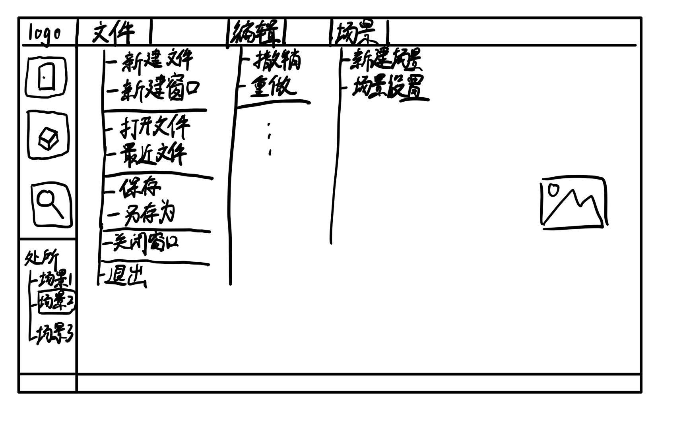

# 项目日志

旨在记录项目建立以来的进展，以及我正在做的事情。

包括每个阶段除代码以外的各种工作细节（以及心情）

## 2.26

- 阅读学习 GitHub 上的 pytq [例子代码](https://github.com/pyqt/examples)

> - 看别人的代码觉得真厉害！

## 2.27

- 继续阅读学习例子代码
- 在自己的测试中尝试写点代码
- 建立ProjectLog项目日志，开始记录项目工程流水账
- 画了个关于软件页面的草图，工具栏组织参考了VSCode
  
- 挑了一些图标，位于`figs\raw\`
- 创建了简单的初始ui界面

> - 看着觉得自己会了，结果自己一写代码就发现啥也写不出来
> - 今天干了好多花里胡哨的活

## 2.28

- 去图书馆借了两本书：《Qt 5开发实战》《Qt 5开发及实例》
- 考虑了一下Qt是用python还是用C++开发，**暂时考虑还是转用 C++ 开发**。原因如下：
  - C++ 的学习资源更丰富
  - C++ 的学习时间更长（虽然Python写起来是真的方便啊啊啊啊啊啊）
  - 看之乎上说 C++ 以后的应用场景更大更多元化，虽然这只是个课程设计但如果能积累一定经验也是极好的
- 另外，Qt Quick似乎比Qt Widget更加适合本次项目设计，因此打算学习Qt Quick框架
  - 但是搞了半天Qt Quick好像也没正常运行，要不还是弄个Widget好了OTL

> - 可惜了前面做的工作，虽然只是开了个头
> - 关于C++开发Qt的经历——我依然能记得上学期花了一个礼拜也没研究清楚二维指针和数组orz
> - 配环境真麻烦……
